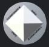

## Welcome to Corporate DAO 

You're hired.
You're fired.
I need you in on Monday.
## <a href="https://discord.gg/dTFACq3Srx">Join our Discord</a>

## What is Corporate DAO?
Corporate DAO is a decentralized organization of thinkers, innovators, and revolutionists. 

Created from a joke that has either gone too far, or not far enough, we seek the answer to one question. 

## What do we do?
We will search for that answer. We will build, and we will learn.

The current plan is to launch on <a href="https://polygon.technology/">Polygon</a>, and do a token airdrop to every member of the Dao. More utility for CORP will be added in the future. 

The airdrop will happen either Jan 16th / or / Jan 31, this decision will be made in dao-votes  voting will close on Jan 10th

In the meantime, please keep adding more people to the Dao. These early weeks of growth are critical to our success. The more brilliant minds we can reach, the more powerful we will become. 

Corporate Dao's goal is to teach members of the DAO more about the crypto space. 
This should be a learning experience for everyone, and a good opportunity for us all to learn a little bit more about blockchain. 
Be friendly, and prepared to teach.

